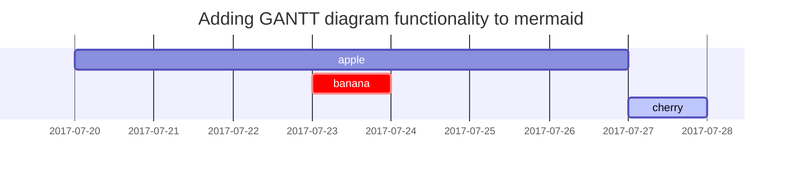

# Coding

# Desing

# Microcontrollers

# Boards

# Communications

# Sensors

# Third Libraries

# Bibliography

- [The c programming language](https://books.google.es/books?id=FGkPBQAAQBAJ&dq=the+c+programming+language+2nd+edition&hl=es&sa=X&ved=2ahUKEwj3u5L-4LTwAhUDAWMBHb3ZA-0Q6AEwAHoECAQQAg){:target="_blank" rel="noopener"}
- [c++ premier plus](https://books.google.es/books?id=ugGBmAEACAAJ&dq=c%2B%2B+primer+plus&hl=es&sa=X&ved=2ahUKEwik3L6T4bTwAhWMoBQKHWJnCv0Q6AEwBXoECAIQAg){:target="_blank" rel="noopener"}
- [Professinal c++](https://books.google.es/books?id=xsFQDwAAQBAJ&lpg=PP1&dq=professional%20c%2B%2B&hl=es&pg=PP1#v=onepage&q=professional%20c++&f=false){:target="_blank" rel="noopener"}
- [c++ Coding Standards](https://books.google.es/books?id=mmjVIC6WolgC&lpg=PP1&dq=c%2B%2B%20coding%20standards&hl=es&pg=PP1#v=onepage&q=c++%20coding%20standards&f=false){:target="_blank" rel="noopener"}
- [Real Time c++](https://books.google.es/books?id=0XZZDwAAQBAJ&lpg=PR2&dq=Real%20time%20c%2B%2B&hl=es&pg=PR2#v=onepage&q&f=false){:target="_blank" rel="noopener"}
- [Clean Code](https://books.google.es/books/about/Clean_Code.html?id=dwSfGQAACAAJ&redir_esc=y){:target="_blank" rel="noopener"}
- [Software Architecture with c++](https://books.google.es/books?id=_-AuzgEACAAJ&dq=Software+architecture+with+c%2B%2B&hl=es&sa=X&ved=2ahUKEwi3mPD337TwAhVi9OAKHQLYDl0Q6AEwAHoECAAQAg){:target="_blank" rel="noopener"}


## Titles
---
# H1 - heading

<h2 data-toc-skip>H2 - heading</h2>

<h3 data-toc-skip>H3 - heading</h3>

<h4>H4 - heading</h4>
---
<br>

## Paragraph

I wandered lonely as a cloud

That floats on high o'er vales and hills,

When all at once I saw a crowd,

A host, of golden daffodils;

Beside the lake, beneath the trees,

Fluttering and dancing in the breeze.

## Lists

### Ordered list

1. Firstly
2. Secondly
3. Thirdly

### Unordered list

- Chapter
	- Setcion
      - Paragraph

### Task list

- [ ] TODO
- [x] Completed
- [ ] Defeat COVID-19
  - [x] Vaccine production
  - [ ] Economic recovery
  - [ ] People smile again

### Description list

Sun
: the star around which the earth orbits

Moon
: the natural satellite of the earth, visible by reflected light from the sun


## Block Quote

> This line to shows the Block Quote.

## Tables

| Company                      | Contact          | Country |
|:-----------------------------|:-----------------|--------:|
| Alfreds Futterkiste          | Maria Anders     | Germany |
| Island Trading               | Helen Bennett    | UK      |
| Magazzini Alimentari Riuniti | Giovanni Rovelli | Italy   |

## Links

[label](www.github.com)


## Footnote

Click the hook will locate the footnote[^footnote], and here is another footnote[^fn-nth-2].


## Images

- Default (with caption)


_Full screen width and center alignment_

<br>

- Specify width

{: width="400"}
_400px image width_

- Shadow

{: .shadow width="90%" }
_shadow effect (visible in light mode)_

<br>

- Left aligned

{: width="350" .normal}

<br>

- Float to left

  {: width="240" .left}
  "A repetitive and meaningless text is used to fill the space. A repetitive and meaningless text is used to fill the space. A repetitive and meaningless text is used to fill the space. A repetitive and meaningless text is used to fill the space. A repetitive and meaningless text is used to fill the space. A repetitive and meaningless text is used to fill the space. A repetitive and meaningless text is used to fill the space. A repetitive and meaningless text is used to fill the space. A repetitive and meaningless text is used to fill the space. A repetitive and meaningless text is used to fill the space. A repetitive and meaningless text is used to fill the space. A repetitive and meaningless text is used to fill the space."

<br>

- Float to right

  {: width="240" .right}
  "A repetitive and meaningless text is used to fill the space. A repetitive and meaningless text is used to fill the space. A repetitive and meaningless text is used to fill the space. A repetitive and meaningless text is used to fill the space. A repetitive and meaningless text is used to fill the space. A repetitive and meaningless text is used to fill the space. A repetitive and meaningless text is used to fill the space. A repetitive and meaningless text is used to fill the space. A repetitive and meaningless text is used to fill the space. A repetitive and meaningless text is used to fill the space. A repetitive and meaningless text is used to fill the space. A repetitive and meaningless text is used to fill the space."

<br>

## Mermaid SVG




## Mathematics

The mathematics powered by [**MathJax**](https://www.mathjax.org/):

$$ \sum_{n=1}^\infty 1/n^2 = \frac{\pi^2}{6} $$

When $a \ne 0$, there are two solutions to $ax^2 + bx + c = 0$ and they are

$$ x = {-b \pm \sqrt{b^2-4ac} \over 2a} $$


## Inline code

This is an example of `Inline Code`.


## Code block

### Common

```
This is a common code snippet, without syntax highlight and line number.
```

### Specific Languages

#### Console

```console
$ env |grep SHELL
SHELL=/usr/local/bin/bash
PYENV_SHELL=bash
```

#### Ruby

```ruby
def sum_eq_n?(arr, n)
  return true if arr.empty? && n == 0
  arr.product(arr).reject { |a,b| a == b }.any? { |a,b| a + b == n }
end
```

#### Shell

```shell
if [ $? -ne 0 ]; then
    echo "The command was not successful.";
    #do the needful / exit
fi;
```

#### Liquid


```liquid

  This product's title contains the word Pack.

```


#### Java

```java
private void writeObject(java.io.ObjectOutputStream s)
  throws java.io.IOException {
  // Write out any hidden serialization magic
  s.defaultWriteObject();
  for (E e: map.keySet()) s.writeObject(e);
}
```

## Reverse Footnote

[^footnote]: The footnote source
[^fn-nth-2]: The 2nd footnote source
